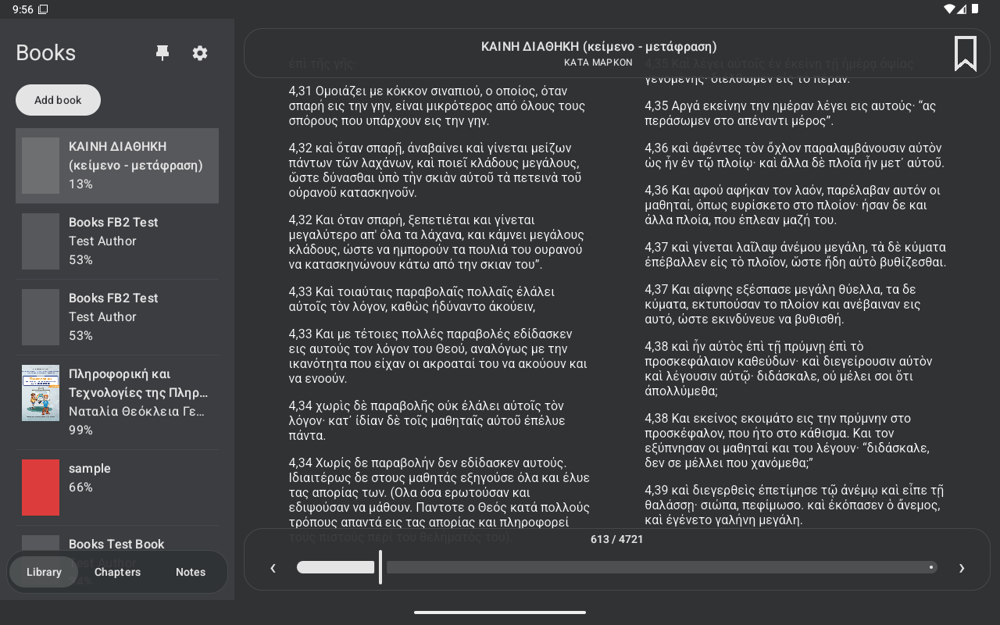
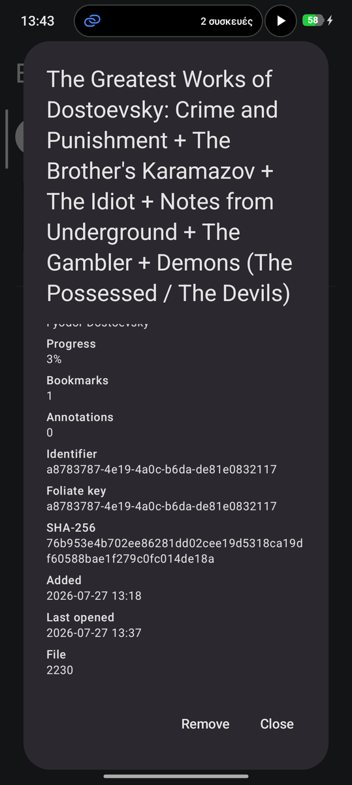

# Books

An offline EPUB reader for Android phones and tablets, built on
[`foliate-js`](https://github.com/johnfactotum/foliate-js) and speaking
[Foliate](https://johnfactotum.github.io/foliate/)'s reading data, so highlights,
notes, bookmarks and reading position move between your desktop and your phone
without conversion.

This is an independent project. It is not an official Foliate application.
No DRM. No network permission.

- Branch: `android-dev`
- Version: 0.0.3
- Licence: `GPL-3.0-or-later`

## Screenshots



*A tablet: the library, the chapters and the notes share one sidebar beside the page.*

| Library | Reading | Book details |
|---|---|---|
|  |  |  |

## What works today

**Library**

- Add books through the system picker; access survives reboots.
- EPUB, PDF, CBZ comics and FB2/FBZ, plus whatever else `foliate-js` can open
  (MOBI/AZW3 is wired up but untested — no file to try it on).
- Cover thumbnails read straight from the book — the first page for a PDF, the
  first image for a comic — stored bounded and app-private.
- Independent reading position per book, restored after a force stop.
- Long press a book for its details: identifiers, SHA-256, counts, dates.

**Reading**

- Paginated and scrolled modes, both crossing chapter boundaries.
- Drag left or right to turn the page; a tap shows or hides the UI. The seek bar
  scrubs at a third of finger speed with a haptic tick per page.
- Chapters from the book's table of contents, with the book's own landmarks and
  printed page numbers beside them when it carries any.
- Search the whole book: results with their chapter and the words around each
  match, every hit outlined in the page, tap to go there.
- Read aloud with the device's voice, in the book's own language: the sentence
  being read is underlined and scrolls into view, and it carries on into the
  next chapter by itself.
- Tap a picture to see it full screen.
- Two low-glare themes, grey on white and white on grey, with the book's own
  colours kept as shades of grey.
- Text size, line spacing, margins and font family.
- Adaptive layout: single pane on a phone; on a tablet the library, the chapters
  and the notes share one sidebar beside the page, as three tabs.
- Pin the sidebar open, or unpin it so it steps aside while you read and comes
  back floating — dragged in from the left edge, or from the reader's button.

**Annotations, Foliate-compatible**

- Highlights in Foliate's palette (yellow, orange, red, magenta, aqua, lime),
  notes on the same record, and bookmarks.
- Import and export Foliate JSON with a preview before anything is written;
  unknown fields survive the round trip untouched.
- Merge on `value` and `modified`, union of bookmarks, warning on identifier
  mismatch.
- Sync inside a folder you already sync (Syncthing, Nextcloud): pick it once and
  every book gets its own directory named after it, holding `annotations.json`.
  Drop an export in from a desktop and the book picks it up when you open it.
- Export as JSON, HTML, Markdown or ORG, the same markup Foliate writes.
- Dictionary, Wikipedia, translation, copy, cite and share from a selection.

## Not yet

MOBI/AZW3 on a real file; OPDS catalogs (they need an Internet permission this
app does not ask for); Calibre's embedded highlights; automatic backup and
restore. See [Plan.md](Plan.md) for the phase-by-phase plan.

## Security

EPUBs are untrusted HTML, so the reader runs in a WebView with no file or
content access, a Content Security Policy that only allows bundled scripts, book
scripts blocked, book documents sanitized, and an origin-checked message channel
instead of a JavaScript interface. The app requests no Internet permission;
links and lookups are handed to apps that already have it.

## Building

Needs a JDK 17 and the Android SDK.

```bash
./gradlew testDebugUnitTest lintDebug assembleDebug
```

```bash
./gradlew connectedDebugAndroidTest
```

The second command needs a device or emulator. On MIUI/HyperOS also enable
Developer options → Install via USB.

## Changelog

### 0.0.3 — 2026-07-28

Search, reading aloud, and the end of a run of selection bugs.

**New**

- Search the whole book. Results arrive chapter by chapter with the words
  around each match, every hit is outlined in the page, and tapping one goes
  there. A sidebar tab on a tablet, in the bottom pill on a phone.
- Read aloud with the device's own voice, in the language the book declares.
  The sentence being read is underlined and scrolled into view, and the reader
  carries on into the next chapter by itself. `foliate-js` produces SSML for
  speech-dispatcher, which Android cannot take, so the reader flattens it and
  feeds the engine one block at a time.
- The book's landmarks and its printed page numbers share the chapters panel,
  each under its own heading. A book with neither looks exactly as before.
- Tap a picture in a book to see it full screen; double tap fills the screen.
  It opens inside the reader page, so book bytes never cross the bridge.
- Bookmarks say where they are — chapter, section, and the words they sit on —
  instead of "Saved page 1". They are still stored as bare CFI, Foliate's way.
- Screen reader labels for the controls that are drawings or punctuation: the
  bookmark ribbon, the page chevrons, back, and read aloud.

**Fixes**

- The selection panel used to close the moment you pressed Note, lose its
  panel when you dragged a handle to widen the selection, and ignore a mouse or
  stylus entirely. All three were the same mistake: Android's selection action
  mode ends for several different reasons and the reader guessed at which. It
  asks the page now.
- Selecting text no longer costs you the reader's controls.
- A file that turns out not to be a book no longer sits in the library as an
  "Opening book…" row. A book you have read keeps its place, its bookmarks and
  its annotations even when today its file cannot be opened.
- Navigating no longer looks like a text selection. `foliate-js` moves the
  caret with the page, which was popping the selection panel open on every
  jump.

**Under it**

- 34 instrumented tests over every panel and dialog, and the controls inside
  them that are not obvious: the two-step remove, the note field, the sidebar
  tabs, the bookmark labels, the search field, the screen reader labels.

### 0.0.2 — 2026-07-28

More formats, a sidebar that earns its space, and two real bugs fixed.

**Formats**

- PDF, CBZ comics and FB2/FBZ open, page and remember their position. The book
  is served under its own extension so `foliate-js` picks the right loader, and
  PDF.js 5 gets the two ES features the Android WebView still lacks.
- PDF covers are rendered from the first page by the platform `PdfRenderer`;
  comics use the first image in the archive.
- Fixed-layout books (PDF, comics) keep paginated controls even in scrolled
  mode, turn by drag, and pinch to zoom.
- A file that is not a book, or a password-protected archive, gives a clean
  error instead of a crash.
- An 18 MB, 77-page PDF was walked end to end five times on a tablet: memory
  settles and stops growing.

**Tablet**

- The library, the chapters and the notes are three tabs in one sidebar, so
  those panels sit beside the page instead of covering it. A phone keeps its
  own pill.
- The sidebar pins open, or unpins to step aside while you read and return
  floating over the page — dragged in from the left edge, or from the reader's
  sidebar button.
- Colours follow libadwaita: the sidebar a step away from the page, lists in a
  rounded well, floating panels the same barely-translucent island as the
  reader chrome.
- The book title and chapter are centred with room to breathe.

**Fixes**

- Highlights no longer vanish when you leave a chapter. `foliate-js` draws an
  annotation only while its section is loaded and keeps no list of its own, so
  the reader now redraws them on every section's overlay — an imported file was
  invisible outside the open chapter before this.
- The selection panel no longer sticks. Tapping away from selected text drops
  the selection inside the WebView without firing a click or a selectionchange,
  so the app never heard it end: the panel stayed open and the reader's islands
  stayed hidden until Cancel was pressed.
- Locally built APKs are out of the repository.

### 0.0.1 — 2026-07-27

First build that is useful to read with.

- EPUB reading through a hardened WebView, with CFI positions compatible with
  Foliate and restored after process death.
- Room library with covers, per-book progress, and book details.
- Paginated and scrolled reading, tap zones, swipes, animated page turns,
  chapters, themes and typography settings.
- Bookmarks, highlights with notes, and the annotations list.
- Foliate JSON import, export and folder sync, plus HTML, Markdown and ORG
  export.
- Verified against a real Foliate export of 567 annotations, kept as a test
  fixture.

## Licence

`GPL-3.0-or-later`. See [LICENSE](LICENSE) and
[THIRD_PARTY_NOTICES.md](THIRD_PARTY_NOTICES.md) for the bundled `foliate-js`,
`zip.js`, `fflate` and PDF.js notices.
